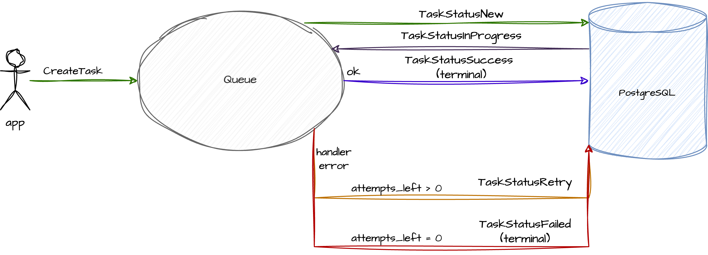

[](https://pkg.go.dev/github.com/dmitysh/pgqugo)
[](https://github.com/dmitysh/pgqugo/actions/workflows/ci.yml)


# pgqugo - Easy and Fast queue for Go based on PostgreSQL

```sh
go get github.com/dmitysh/pgqugo
```

## Quickstart
1) Install package
2) Apply migrations from *migrations* folder using goose (or manually)
3) Use pgqugo! More examples in *queue_test.go*

```Go
q := pgqugo.New(
    adapter.NewPGXv5(s.pool),
    pgqugo.TaskKinds{
        pgqugo.NewTaskKind(
            taskKind, // your task kind
            h, // your handler
            pgqugo.WithFetchPeriod(time.Second*2, 0.2),
            pgqugo.WithMaxAttempts(3),
            pgqugo.WithAttemptDelayer(delayer.Linear(time.Second*10, 0.2)),
            pgqugo.WithWorkerCount(5),
        ),
    },
)

q.Start()

for i := 0; i < taskCount; i++ {
    task := pgqugo.Task{
        Kind:    taskKind,
        Payload: "{}",
    }
}

q.Stop()
```

## Adapters
The adapters package contains implementations of the DB interface used by the queue.
Wrappers allow you to use a specific driver to work with PostgreSQL. List of supported adapters:
* pgx/v5

The list is updated based on user requests. In addition, you can independently implement an adapter for your stack.

## Extra features
* Kind+key optional idempotency
* Cleaner job

## Settings
* Number of task's attempts, attempt interval, attempt timeout
* Fetch query's parameters (batch size, interval)
* Number of worker gorutines
* Cleaner's parameters (interval, limit, TTL of terminal tasks)
* Logger
* Statistics collector

## Example usage

## Status model
